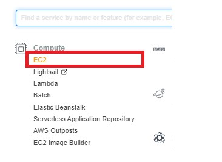
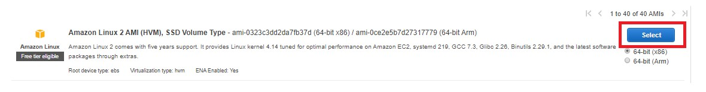
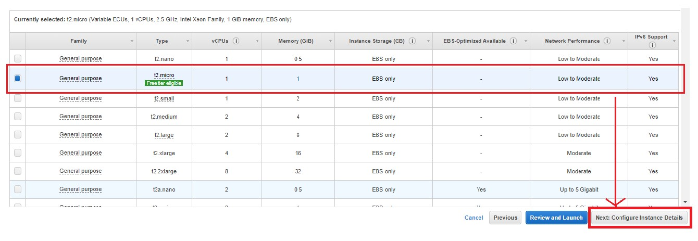
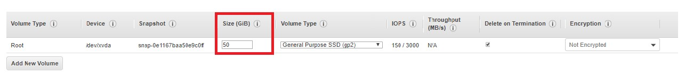
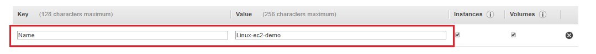
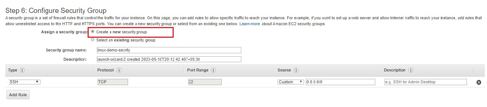
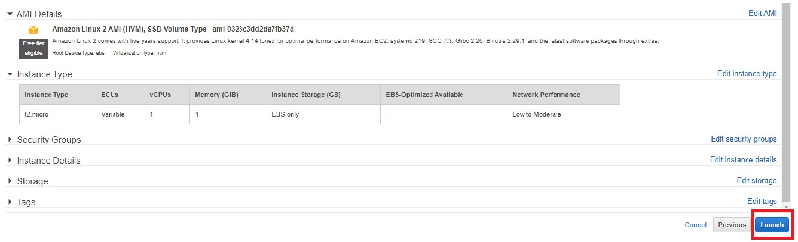
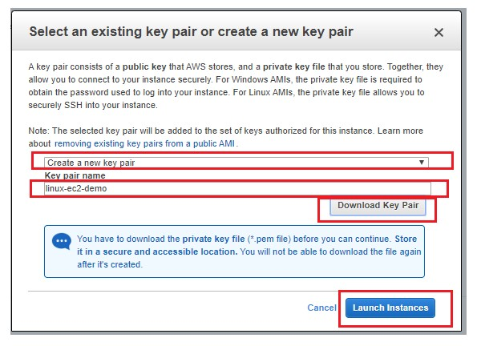
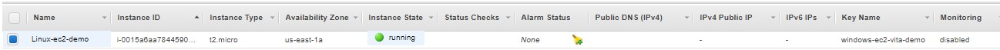

## -How to make EC2 Instance for Linux based Operatint System

**Step 1-** Open the AWS management console and click on drop-down option *services*.

**Step 2-** Now under the Compute section click on EC2 option or simply you can type EC2 in search box and open it.

**Step 3-** Click on the *Launch instance* button at the top of the left side.

**Step 4-** Select operating system as Amazon Linux AMI (HVM) 

**Step 5-** after selecting operating system next window of *“Choose an instance type”* will opens.
In that window we will select the RAM and CPU processor.
So for we select t2-micro type which consist of single core CPU and 1GB of RAM and click on *Next configure instance Detail’s*

**Step 6-** Now *Configure Instance Details* window will open here we configure our instance like network, subnet ,IAM role, VPC etc. 
Use default settings we can change as per our requirement.
So click on *Add storage* 

**Step 7-** Now “Add Storage” window will open. Here we can add the storage size as per our requirement.

Now click on *Add Tags* bottom right corner option

**Step 8-** Now Tags are consist of the Key-Value pair. Tag Key=name and Value=name for the instance which we want to create.

Now click on *“Next: Configure Security Group”*

**Step 9-** Now configure the security group by selecting *“Create new security group”*. 
Here you can give any security group name whatever you want.

Now click on *“Review and Launch”*

**Step 10-** Now “Review Instance Launch” window will open. Here you can see all the details that you configured for your instance. 
Now Click on **Launch** when you are final with your all configuration.

**Step 11-** Now Key-pair window will open. Here select *“Create a new key pair”* and you can give any key pair name.
Now *“Download key pair”* it will download **.pem** file. This file is important keep it with yourself.

After downloading key pair *“Launch Instance”* option will enable.
Now click on *Launch Instance*.

*Wait for a moment after clicking on launch Instance

*This is how you are done with your Linux operating system based EC2 instance.

